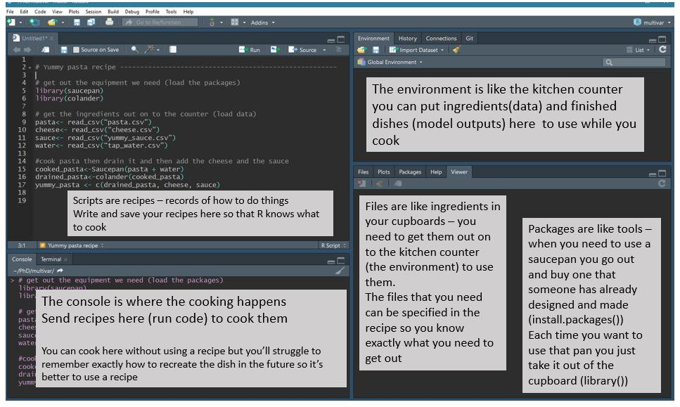
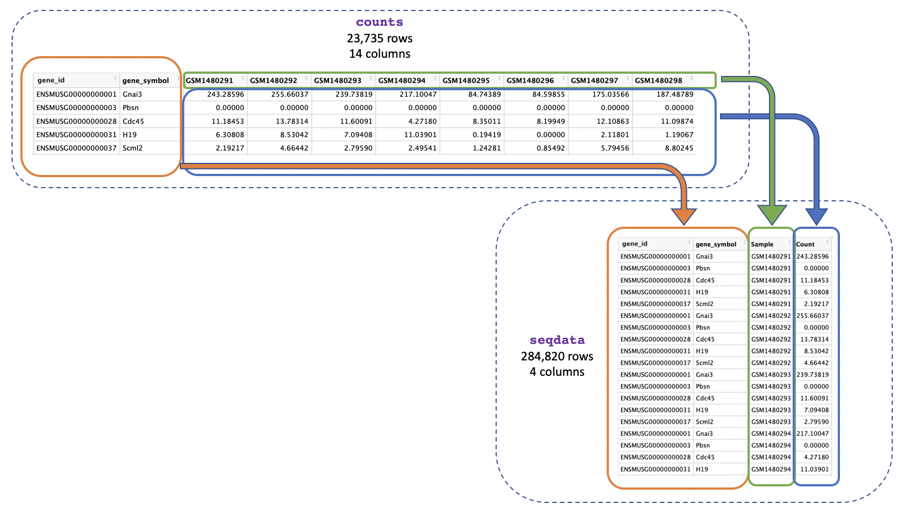
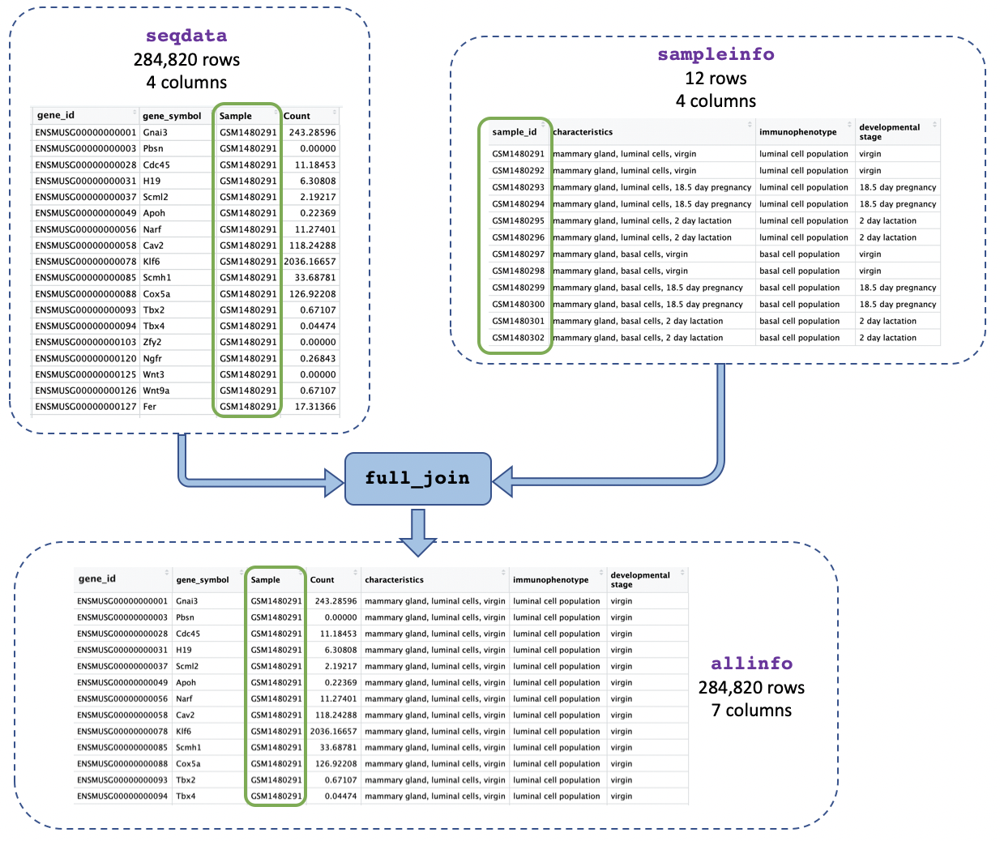
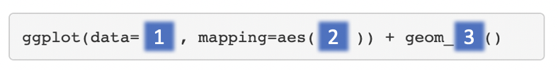

```{=html}
<!--
Show / hide answers to exercises.
Code adapted from: https://chrisbeeley.net/?p=1104
-->
```
```{=html}
<script>
function myFunction(id) {
    var x = document.getElementById(id);
    if (x.style.display === "none") {
        x.style.display = "block";
    } else {
        x.style.display = "none";
    }
}
</script>
```
```{=html}
<style>
div .info {
  margin: auto;
  background-color: #EAF0FB;
  width: 95%;
  padding: 10px;
}
</style>
```
```{r setup, include=FALSE}
# Smaller images for pdf
# knitr::opts_chunk$set(out.width="50%")
options(width=80)
```

# R for Biologists course

R takes time to learn, like a spoken language. No one can expect to be
an R expert after learning R for a few hours. This course has been
designed to introduce biologists to R, showing some basics, and also
some powerful things R can do (things that would be more difficult to do
with Excel). The aim is to give beginners the confidence to continue
learning R, so the focus here is on tidyverse and visualisation of
biological data, as we believe this is a productive and engaging way to
start learning R. After this short introduction you can read [this
book](https://bookdown.org/ansellbr/WEHI_tidyR_course_book) to dive a
bit deeper.

Most R programmers do not remember all the command lines we share in
this document. R is a language that is continuously evolving. They use
Google extensively to use many new tricks. Do not hesitate to do the
same!

# 1. Intro to R and RStudio

RStudio is an interface that makes it easier to use R. There are four
windows in RStudio. The screenshot below shows an [analogy linking the
different RStudio windows to
cooking](https://twitter.com/RLadiesNCL/status/1138812826917724160).



     

## R script vs console

There are two ways to work in RStudio in the console or in a script. We
can type a command in the console and press `Enter` to run it.

**Your turn 1.1:** Run the command below in the console.

```{r, eval = FALSE}
1 + 1
```

Or we can use an R script. To run a command line, we place the cursor on
the line you want to run, and then either:

-   Click on the `run` button on top of the panel
-   Use `Ctrl` + `Enter` (Windows/Linux) or `Cmd` + `Enter` (MacOS).

We can also highlight multiple lines at once and run them at once.

**Your turn 1.2:** Create a script from the top menu in RStudio:
`File > New File > R Script`, then type the command below in the script
and run it with one or the two options.

```{r, eval = FALSE}
2 + 2
```

<p>

::: info
**ⓘ Using a script is recommended practice**\
If we work in the console, we do not have a good record (recipe) of what
we have done. It is good practice to use an R script to be able to
re-use the code and remember what we have done in the past.
:::

</p>


## Commenting

Comments are notes to ourself or others about the commands in the
script. They are useful also when you share code with others. Comments
start with a `#` which tells R not to run them as commands.

```{r, eval = FALSE}
# testing R
2 + 2
```

Keeping an accurate record of how you have manipulated your data is
important for [reproducible
research](https://ropensci.github.io/reproducibility-guide/sections/introduction/).
Writing detailed comments and documenting your work are useful reminders
to your future self (and anyone else reading your scripts) on what your
code does. 

## Working directory

Opening an RStudio session launches it from a specific location. This is
the 'working directory'.

*R looks in the working directory by default to read in data and save
files.* You can find out what the working directory is by using the
command `getwd()`. This shows you the path to your working directory in
the console. It will be in this format: `/path/to/working/directory`
(Mac) or `C:\path\to\working\directory` (Windows). We recommend keeping your
data and R scripts in the same directory.

To define the working directory, click in the menu on
`Session > Set Working Directory > Choose directory` and choose your
folder.

**Your turn 1.3:** Create a folder for this course somewhere on your
computer. Name the folder for example, `Intro_R_course`. Then, to set
this folder as your working directory. Set your working directory as
indicated above. 

You will see that once you have set your working directory, the files inside 
your new folder will appear in the 'Files' window on RStudio.  

**Your turn 1.4:** Save the script you created in the previous section
as `intro.R` in this directory. You can do this by clicking on
`File > Save` and the default location should be the current working
directory (e.g. `Intro_R_course`).

You might have noticed that when you set your working directory in the previous
step, a line appeared in your console saying something like 
`setwd("~/Desktop/Intro_R_course")`. As well as the point-and-click method
described above, you can also set your working directory using this command in 
the console or in a script. Setting this command at the top of your script is a
good way to make sure your script always runs from the right location on your 
computer. 

**Your turn 1.5:** Add a line at the top of your newly created script `intro.R`
so that the working directory is set to your newly made folder `Intro_R_course`. 

## Functions

In mathematics, a function defines a relation between inputs and output.
In R (and coding languages) it is the same. A function (also called a command)
takes several inputs called *arguments* inside parentheses, and output some results.
We have actually already used a function in this workshop - `setwd()`. This 
function takes an input (the path to where you want to working directory to
be set) and performs an action (sets the working directory). Let's take a look
at some more functions below. 

**Your turn 1.6:** Compare these two outputs. In the second line we use
the function `sum()`.

```{r, eval = FALSE}
2+2
sum(2,2)
```

**Your turn 1.7:** Try using the below function with different inputs, what 
does it do?

```{r, eval = FALSE}
sqrt(9)
sqrt(81)
```

## Objects

It is useful to store data or result so that we can use them later on
for other parts of the analysis. To do this, we turn the data into an object (also
called a variable). We can use either the operator `=` or `<-` to do this. In both 
cases the object where we store the result is on the left-hand-side, and the result 
from the operation is on the right-hand-side. 

For example, the below code assigns the number `5` to the object `X` using the `=`
operator. You can print out what the `X` object is by just typing it into the console.

**Your turn 1.8:** Make an object called `X` and print it. 

```{r, eval = FALSE}
X = 5
X
```

As described above, you can assign objects using eith the `=` or `<-` operator. 

**Your turn 1.9:** Compare the two outputs.

```{r, eval = FALSE}
result1 = 2+2
result1

result2 <- 2+3
result2
```

Once you have assigned objects, you can perform manipulations on them using functions. 

**Your turn 1.10:** Compare the two outputs.

```{r, eval = FALSE}
sum(1,2)

X <- 1
Y <- 2
sum(X,Y)
```

Remember, if you use the same object name multiple times, R will overwrite the previous object you had created. 

**Your turn 1.11:** What is the value of X after running this code?
```{r, eval = FALSE}
X <- 5
X <- 10
```

<button onclick="myFunction('q3')">

Show solutions

</button>

::: {#q3 style="display:none"}

X is 10, the previous value of 5 has been overwritten. 

:::

<!-- end solutions -->


<p>

::: info
**ⓘ Nomenclature of objects**\

We recommend you use explicit naming conventions of your objects, for
example `data.raw1` and `data.normalised` rather than `data1` and
`data2` so that you can remember various steps in your analysis.
:::

</p>

# 2. R Packages

We have seen that functions are really useful tools which can be used to manipulate data. 
Although some basic functions, like `sum()` and `setwd()` are avaliable by default when you 
install R, some more exciting functions are not. There are thousands of R functions avaliable 
for you to use, and functions are organised into groups called packages or libraries. An R 
package contains a collection of functions (usually that perform related tasks), as well as 
documentation to explain how to use the functions. Packages are made by R developers who wish
to share their methods with others. 

Once we have identified a package we want to use, we can install and load it so we can use it. 
Here we will use the `tidyverse` package which includes lots of useful functions for data 
managing, we will use the package later in this session. 

**Your turn 2.1:** Install the `tidyverse` package. 
```{r, eval=FALSE}
install.packages("tidyverse")
```

We then load the package in our working directory:

**Your turn 2.2:** Load the `tidyverse` package so we can use it. 
```{r, eval=FALSE}
library(tidyverse)
```


## Packages in the CRAN or Bioconductor

Packages are hosted in different locations. Packages hosted on [CRAN](https://cran.r-project.org/) 
(stands for Comprehensive R Archive Network) are often generic package for all sorts
of data and analysis. [Bioconductor](https://bioconductor.org/) is an
ecosystem that hosts packages specifically dedicated to biological data.

The installation of packages frp, Bioconductor is a bit different, 
e.g to install the `mixOmics` package we type:

**Your turn 2.3:** Install the `mixOmics` package from Bioconductor. 
```{r, eval=FALSE}
if (!require("BiocManager", quietly = TRUE))
    install.packages("BiocManager")

BiocManager::install("mixOmics")
```

You dont need to remember this command line, as it is featured in the
Bioconductor package page (see
[here](https://bioconductor.org/packages/release/bioc/html/mixOmics.html)
for example).

One advantage of Bioconductor packages is that they are well documented,
updated and maintained every six months.

## I need help!

As described above, every R package includes documentation to explain how to use functions. 
For example, to find out what a function in R does, type a `?` before the name and help
information will appear in the Help panel on the right in RStudio.

**Your turn 2.4:** Find out what the `sum()` command does. 
```{r, eval=FALSE}
?sum
```

What is really important is to scroll down the examples to understand
how the function can be used in practice. You can use this command line
to run the examples:

**Your turn 2.5:** Run some examples of the `sum()` command.
```{r, eval=FALSE}
example(sum)
```

Packages also come with more comprehensive documentation called vignettes. These 
are really helpful to get you started with the package and identify which functions
you might want to use. 

**Your turn 2.6:** Have a look at the `tidyverse` package vignette. 
```{r, eval=FALSE}
browseVignettes("tidyverse")
```


## Common R errors

R error messages are common and often cryptic. You most likely will
encounter at least one error message during this tutorial. Some common
reasons for errors are:

-   Case sensitivity. In R, as in other programming languages, case
    sensitivity is important. `?install.packages` is different to
    `?Install.packages`.
-   Missing commas
-   Mismatched parentheses or brackets or unclosed parentheses, brackets
    or apostrophes
-   Not quoting file paths
-   When a command line is unfinished, the "+" in the console will
    indicate it is awaiting further instructions. Press ESC to cancel
    the command.

To see examples of some R error messages with explanations see
[here](https://github.com/noamross/zero-dependency-problems/issues/7)


<p>

::: info
**ⓘ More information for when you get stuck**\

As well as using package vignettes and documentation, Google and [Stack Overflow](https://stackoverflow.com/) 
are also useful resources for getting help.
:::

</p>

# 3. Let's get started with data!

In this tutorial, we will learn some R through creating plots to
visualise data from an RNA-seq experiment.

The [GREIN platform](https://www.nature.com/articles/s41598-019-43935-8)
(GEO RNA-seq Experiments Interactive Navigator) provides \>6,500
published datasets from GEO that have been uniformly processed. It is
available at <http://www.ilincs.org/apps/grein/>. You can search for a
dataset of interest using the GEO code. GREIN provide QC metrics for the
RNA-seq datasets and both raw and normalized counts. We will use the
normalized counts here. These are the counts of reads for each gene for
each sample normalized for differences in sequencing depth and
composition bias. Generally, the higher the number of counts the more
the gene is expressed.

## RNA-seq dataset form Fu et al.

Here we will create some plots using RNA-seq data from the paper by [Fu
et al. 2015](https://www.ncbi.nlm.nih.gov/pubmed/25730472), GEO code
GSE60450. This study examined expression in basal and luminal cells from
mice at different stages (virgin, pregnant and lactating). There are 2
samples per group and 6 groups, 12 samples in total.

{width="396"}

## Tidyverse package

The `tidyverse` package that we installed in section 2 is a collection of R packages 
that includes the extremely widely used **`ggplot2`** package.

The [tidyverse](https://www.tidyverse.org/) makes data science faster,
easier and more fun.

## Load the package

We use `library()` to load in the packages that we need. As described in
the cooking analogy in the first screenshot, `install.packages()` is
like buying a saucepan, `library()` is taking it out of the cupboard to
use it.

**Your turn 3.1:** Load your tidyverse library. If you get an error
message, it means that you have not installed it! (see the code in the
Section 2).

```{r, message=FALSE, warning=FALSE}
library(tidyverse)
```

## Load the data

The files we will use are in a format called csv (comma-separated values), 
so we will use the `read_csv()` function from the tidyverse. There is also 
a `read_tsv()` function for tab-separated values.

**Your turn 3.2:** Download the data.zip file
[here](https://melbintgen.github.io/intro-to-r/data.zip). Unzip the file
and **store the content in the `data` folder in your working
directory**.

We will use the counts file called
`GSE60450_GeneLevel_Normalized(CPM.and.TMM)_data.csv` stored in the data
folder. The path to the file should be
`data/GSE60450_GeneLevel_Normalized(CPM.and.TMM)_data.csv`.

**Your turn 3.3:** Load the count data into your R working directory. We will
store the contents of the counts file in an **object** called `counts`. 

```{r}
# read in counts file
counts <- read_csv("data/GSE60450_GeneLevel_Normalized(CPM.and.TMM)_data.csv")
```

No need to be overwhelmed by the outputs! It contains information
regarding "column specification" (telling us that there is a missing
column name in the header and it has been filled with the name "...1",
which is how read_csv handles missing column names by default). We will
fix this later. It also tells us what data types `read_csv` is detecting
in each column. Columns with text characters have been detected
(`col_character`) and also columns with numbers (`col_double`). We won't
get into the details of R data types in this tutorial but they are
important to know when you get more proficient in R. You can read more
about them in the [R for Data Science
book](https://r4ds.had.co.nz/vectors.html#important-types-of-atomic-vector).

**Your turn 3.4:** Load the sample information data into your R working directory. We will store the contents of this file in an object called 
`sampleinfo`. 

```{r}
# read in metadata
sampleinfo <- read_csv("data/GSE60450_filtered_metadata.csv")
```

It is very common when looking at biological data that you have two types of data. One is the actual data (in this case, our `counts` object, which has the
expression values of different genes in each sample). The other is **metadata**
i.e. information about our samples (in this case, our `sampleinfo` object includes information about whether samples are from basal or luminal cells and
whether the cells were from mice which are virgin/pregnant/lactating, etc.)

# 4. Looking at the data

When assigning a value to an object, R does not print the value. We do
not see what is in `counts` or `sampleinfo`. But there are ways we can
look at the data.

**Your turn 4.1:** Option 1: Click on the `counts` object in your global
environment panel on the right-hand-side of RStudio. It will open a new
Tab.

**Your turn 4.2:** Option 2: type the name of the object and this will
print the first few lines and some information, such as number of rows.
Note that this is similar to how we looked at the value of objects we 
assigned in section 1. 

```{r}
counts
```

We can also take a look the first few lines with `head()`. This shows us
the first 6 lines.

**Your turn 4.3:** Use `head()` to look at the first few lines of `counts`. 
```{r}
head(counts)
```

We can look at the last few lines with `tail()`. This shows us the last
6 lines. This can be useful to check the bottom of the file, that it
looks ok.

**Your turn 4.4:** Use `tail()` to look at the last few lines of `counts`. 
```{r}
tail(counts)
```

**Your turn 4.5:** What are the cell type of the first 6 samples in the metadata for the Fu et al. 2015 experiment?

<button onclick="myFunction(&#39;q45&#39;)">

Show solutions

</button>

::: {#q45 style="display:none"}

```{r}
head(sampleinfo)
```

The first 6 samples are luminal cells. 

:::

<!-- end solutions -->


## Dimension of the data

It is very useful to check that what you have read in R corresponds to
the number of lines and columns that you expect to see in your data. 
You can print the number of rows and columns using the function `dim()`. 

**Your turn 4.6:** Check how many rows and columns are in `counts` and in `sampleinfo`. 

```{r, eval = FALSE}
dim(counts)
dim(sampleinfo)
```

This show us there are 23735 rows and 14 columns in the count data (i.e. 23735 genes and 12 samples, note the first two columns are gene IDs and gene names).

In the metadata there are 12 rows and 4 column (i.e. 12 samples and 4 bits of information per sample). 

In the Environment Tab in the top right panel in RStudio we can also see
the number of rows and columns in the objects we have in our session.

## Column and row names of the data

**Your turn 4.7:** Check the column and row names used in in
`sampleinfo`. Comment on the results you get.

```{r, eval = FALSE}
colnames(sampleinfo)
rownames(sampleinfo)
```

## The `$` symbol

We can access individual columns by name using the `$` symbol. 

**Your turn 4.8:** Extract the 'immunophenotype' column of the metadata. 
```{r, eval = FALSE}
sampleinfo$immunophenotype
```

## Subsetting

Subsetting is very important in R to extract parts of the data you want
to analyse. In R, a data set has the form of a matrix with rows and
columns. You can access these rows or columns by using square brackets.

For example, we can extract the first row '1' of the data, using the number
on the *left-hand-side* of the comma.

**Your turn 4.9:** Extract the first row using square brackets. 
```{r, eval = FALSE}
sampleinfo[1,]
```

Here we extract the second column '2' of the data, as indicated on
the *right-hand-side* of the comma.

**Your turn 4.10:** Extract the second column using square brackets. 
```{r, eval = FALSE}
sampleinfo[,2]
```

You can use a combination of number of row and column to extract one
element in the matrix. 

**Your turn 4.11:** Extract the element in the first row and second column. 
```{r, eval = FALSE}
sampleinfo[1,2]
```

**Your turn 4.12:** Work out what the following commands mean, then
use one of them to subset `sampleinfo` so you extract the first 3 rows:

```{r, eval = FALSE}
1:3
c(1, 3)
```

<button onclick="myFunction('q2')">

Show solutions

</button>

::: {#q2 style="display:none"}

```{r, eval = TRUE}
sampleinfo[1:3,]
```

:::

<!-- end solutions -->

<p>

::: info
**ⓘ The c() function**

We use the `c()` function extremely often in R when we have multiple items
that we are *combining* ('c' stands for concatenating). We will see it
again in this tutorial.
:::

</p>

In the previous section, when we loaded in the data from the csv file,
we noticed that the first column had a missing column name and by
default, read_csv function assigned a name of "\...1" to it. We can
change this column to something more descriptive by combining what what
we have learnt.

**Your turn 4.13:** Describe what the next command line is doing:

```{r, eval = TRUE, show = FALSE}
colnames(sampleinfo)[1] <- "sample_id"
# check
sampleinfo
```

**Your turn 4.14:** Do the same to rename the first column name from
"\...1" to "gene_id" in `counts`.

<button onclick="myFunction(&#39;q1&#39;)">

Show solutions

</button>

::: {#q1 style="display:none"}
```{r}
colnames(counts)[1] <- "gene_id"
# check
head(counts)
```
:::

<!-- end solutions -->

## Other useful commands: `str` and `summary`

`str()` shows us the structure of our data. It shows us what columns
there are, the first few entries, and what data type they are e.g.
character or numbers (double or integer).

**Your turn 4.15:** Show the structure of the metadata
```{r, eval = FALSE}
str(sampleinfo)
```

`summary()` generates summary statistics of our data. For numeric
columns (columns of type double or integer) it outputs statistics such
as the min, max, mean and median. We will demonstrate this with the
counts file as it contains numeric data. For character columns it shows
us the length (how many rows).

**Your turn 4.16:** Generate summary statistics for the count data
```{r, eval = FALSE}
summary(counts)
```

<p>

::: info
**ⓘ Multiple methods**\
There are multiple ways to do things in R. For example we used the
function `colnames` in the previous exercise, but we could have used the
`rename()` function. When programming, you will often find many ways to
do the same thing. Often there is one obvious method depending on the
context.
:::

</p>

# 5. Formatting data

## Converting from wide to long format

We will first convert the data from wide format into long format to make
it easier to work with and so that we can plot the data with the `ggplot` package.

Instead of multiple columns with counts for each sample, we just want
one column containing all the expression values, as shown below:



We can use `pivot_longer()` to easily change the format into long
format.

**Your turn 5.1:** Find out what `pivot_longer()` does and how to use it
```{r}
?pivot_longer
```

**Your turn 5.2:** Convert the counts data into long format and save it as a new object called `seqdata`
```{r}
seqdata <- pivot_longer(counts, cols = starts_with("GSM"), 
                        names_to = "Sample", values_to = "Count")
```

*Explanation*: 
We use `cols = starts_with("GSM")` to tell the function we want to reformat the columns whose names start with "GSM" (these columns are the ones where we have the gene counts).
`pivot_longer()` will then reformat the specified columns into two new columns, which 
we're naming "Sample" and "Count". 
The`names_to = "Sample"` specifies that we want the new column containing the columns to be named "Sample", and the`values_to = "Count"` specifies that we want the new column containing the values to be named "Count".

As explained earlier, in R there is often more than one way to do the same thing. We could
get the same result by specifying the argument `cols` in a different way. For example, 
instead of using `starts_with` we could use a range like the one you used in question 4.12. 

**Your turn 5.3:** Convert the counts data into long format using a column range
```{r}
seqdata <- pivot_longer(counts, cols = GSM1480291:GSM1480302, 
                        names_to = "Sample", values_to = "Count")
```

Another way we could do the same thing is by specifying the columns we *do not* want to reformat, this will tell `pivot_longer()` to reformat all the other columns. To do that 
we put **a minus sign "-"** in front of the column names that we don't want
to reformat. This is a pretty common way to use `pivot_longer()` as
sometimes it is easier to exclude columns we don't want than include
columns we do. The command below would give us the same result as the
previous command.

**Your turn 5.4:** Convert the counts data into long format by specifying which columns not to convert
```{r}
seqdata <- pivot_longer(counts, cols = -c("gene_id", "gene_symbol"), 
                        names_to = "Sample", values_to = "Count")
```

**Your turn 5.5:** Type each command line above, then look at the data, are all three of the `seqdata` objects you made the same?

<button onclick="myFunction(&#39;q51&#39;)">

Show solutions

</button>

::: {#q51 style="display:none"}

```{r, eval = FALSE}
dim(seqdata)
length(seqdata)
```

All three `seqdata` objects are the same, as we did the same conversion from wide to long format using 3 different methods. `seqdata` has 284820 rows and 4 columns, and has length 4. 

:::

<!-- end solutions -->

## Joining two tables

Now that we've got just one column containing sample ids in both our
counts and metadata objects we can join them together using the sample
ids. This will make it easier to identify the categories for each sample
(e.g. if it's basal cell type) and to use that information in our plots.



*Explanation:* We use the function `full_join()` and give as arguments
the two tables we want to join. We add
`by = join_by(Sample == sample_id)` to say we want to join on the column
called "Sample" in the first table (`seqdata`) and the column called
"sample_id" in the second table (`sampleinfo`) when the values match:

**Your turn 5.6:** Join the count data and metadata by matching sample IDs
```{r}
allinfo <- full_join(seqdata, sampleinfo, by = join_by(Sample == sample_id))
```

**Your turn 5.7:** Have a look at the new object you generated above and see what information it includes, how many columns does it have and what does each column tell you?

<button onclick="myFunction('q4')">

Show solutions

</button>

::: {#q4 style="display:none"}
```{r eval=TRUE}
dim(allinfo)
colnames(allinfo)
```

The `allinfo` object has 7 columns which tell you about the gene id and symbol, the same id, gene count, and sample information (characteristics, immunophenotype, and developmental stage). 

:::

<!-- end solutions -->

# 6. Plotting with **`ggplot2`**

**`ggplot2`** is a plotting package that makes it simple to create
complex plots. One really great advantage compared to classic R packages
is that we only need to make minimal changes if the underlying data
change or if we decide to change our plot type, for example, from a box
plot to a violin plot. This helps in creating publication quality plots
with minimal amounts of adjustments and tweaking.

**`ggplot2`** likes data in the 'long' format, i.e., a column for every
variable, and a row for every observation, similar to what we created
with `pivot_longer()` above. Well-structured data will save you lots of
time when making figures with **`ggplot2`**.

<p>

::: info
**ⓘ Ggplot architecture**

Ggplot graphics are built step by step by adding new elements using the
`+`. Adding layers in this fashion allows for extensive flexibility and
customization of plots.
:::

</p>

To build a ggplot, we use the following basic template that can be used
for different types of plots. Three things are required for a ggplot:



1.  The data
2.  The columns in the data we want to map to visual properties (called
    aesthetics or `aes`) e.g. the columns for x values, y values and
    colours
3.  The type of plot (the `geom_`)

There are different geoms we can use to create different types of plot
e.g. `geom_line()` `geom_point()`, `geom_boxplot()`. To see the geoms
available take a look at the ggplot2 help or the handy [ggplot2
cheatsheet](https://rstudio.github.io/cheatsheets/data-visualization.pdf).
Or if you type "geom" in RStudio, RStudio will show you the different
types of geoms you can use.

## Creating a boxplot

Let's plot boxplots to visualise the distribution of the counts for each
sample. This helps us to compare the samples and check if any look
unusual.

*Note: with ggplot the "+" must go at the end of the line, it can't go
at the beginning.*

**Your turn 6.1:** Run the following command line. Identify the key
functions `aes` and type of plot:

```{r}
ggplot(data = allinfo, mapping = aes(x = Sample, y = Count)) + 
  geom_boxplot()
```

This plot looks a bit weird. It's because we have some genes with
extremely high counts. To make it easier to visualise the distributions
we usually plot the logarithm of RNA-seq counts. We'll plot the Sample
on the X axis and log\~ 2\~ Counts on the y axis. We can log the Counts
within the `aes()`. The sample labels are also overlapping each other,
we will show how to fix this later.

**Your turn 6.2:** Generate a boxplot of log2 gene counts

```{r}
ggplot(data = allinfo, mapping = aes(x = Sample, y = log2(Count))) + 
  geom_boxplot()
```

We get a warning here about rows containing non-finite values being
removed. This is because some of the genes have a count of zero in the
samples and a log of zero is undefined. We can add +1 to every count to
avoid the zeros being dropped ('psuedo-count').

**Your turn 6.3:** Generate a boxplot of log2 gene counts + 1
```{r}
ggplot(data = allinfo, mapping = aes(x = Sample, y = log2(Count + 1))) + 
  geom_boxplot()
```

The box plots show that the distributions of the samples are not
identical but they are not very different.

## Violin plot

Boxplots are useful summaries, but hide the shape of
the distribution. For example, if the distribution is bimodal, we would
not see it in a boxplot. An alternative to the boxplot is the **violin
plot**, where the shape (of the density of points) is drawn.

Let's choose a different geom to do another type of plot. 

**Your turn 6.4:**  Using the same data (same x and y values), try editing the code 
above to make a violin plot using the `geom_violin()` function.

<button onclick="myFunction('q5')">

Show solutions

</button>

::: {#q5 style="display:none"}
```{r eval=TRUE}
# Plotting a violin plot
ggplot(data = allinfo, mapping = aes(x = Sample, y = log2(Count + 1))) + 
  geom_violin()
```
:::

<!-- end solutions -->

## Colouring by categories

Let's add a different colour for each sample.

**Your turn 6.5:** Get the help file for `geom_boxplot` and scroll down
to **Aesthetics** heading. It specifies that there is an option for
colour.

**Your turn 6.6:** Map each sample to a colour using the `colour =` argument. 
As we are mapping colour to a column in our data we need toput this inside `aes()`.

```{r}
ggplot(data = allinfo, mapping = aes(x = Sample, y = log2(Count + 1), colour = Sample)) + 
  geom_boxplot()
```

Colouring the edges wasn't quite what we had in mind. Look at the help
for `geom_boxplot` to see what other aesthetic we could use. Let's try
`fill =` instead.

**Your turn 6.7:** Map each sample to a colour using the `fill =` argument. 
```{r}
ggplot(data = allinfo, mapping = aes(x = Sample, y = log2(Count + 1), fill = Sample)) + 
  geom_boxplot()
```

That looks better. `fill =` is used to fill in areas in ggplot2
plots, whereas `colour =` is used to colour lines and points.

A really nice feature about ggplot is that we can easily colour by
another variable by simply changing the column we give to `fill =`.

## Creating subplots for each gene using faceting

With ggplot we can easily make subplots using *faceting*. For example we
can make
[stripcharts](http://www.sthda.com/english/wiki/ggplot2-stripchart-jitter-quick-start-guide-r-software-and-data-visualization).
These are a type of scatterplot and are useful when there are a small
number of samples (when there are not too many points to visualise).
Here we will make stripcharts plotting expression by the groups (basal
virgin, basal pregnant, basal lactating, luminal virgin, luminal
pregnant, luminal lactating) for each gene.

### Shorter category names

As we saw in question 5.5, our column names are quite long, and this might make them
difficult to visualise on a plot. We can use the function `mutate()` to add another column to our `allinfo` object with shorter group names. 

**Your turn 6.8:** Make a new column in `allinfo` with shortened category names using the below code. How has the object `allinfo` changed?

```{r}
allinfo <- mutate(allinfo, Group = case_when(
        str_detect(characteristics, "basal.*virgin") ~  "bvirg",
        str_detect(characteristics, "basal.*preg")  ~  "bpreg",
        str_detect(characteristics, "basal.*lact")  ~  "blact",
        str_detect(characteristics, "luminal.*virgin")  ~  "lvirg",
        str_detect(characteristics, "luminal.*preg")  ~  "lpreg",
        str_detect(characteristics, "luminal.*lact")  ~  "llact"
       ))
```

<button onclick="myFunction(&#39;q7&#39;)">

Show solutions

</button>

::: {#q7 style="display:none"}
#### Answers

```{r}
head(allinfo)
```

We observe a new column called `Group` at the end which has shortened category names, bvirg, lpreg, etc. 

:::

<!-- end solutions -->

### Filter for genes of interest

**Your turn 6.9:** How many genes are there in our data?

<button onclick="myFunction('q21')">

Show solutions

</button>

::: {#q21 style="display:none"}
#### Answers

```{r}
dim(counts)
```

There are 23735 rows in our original counts data, so we have data on 23735 different genes. Note: we didn't run `dim()` on our `allinfo` object because this has multiple rows per gene. 

:::

<!-- end solutions -->

Like our data set, most RNA-seq data sets have information on thousands of genes, but most of them are usually not very interesting, so we may want to filter them. 

Here, we choose 8 genes with the highest counts summed across all samples. They
are listed here. 

**Your turn 6.10:** Create an object with a list of the 8 most highly expressed genes
```{r}
mygenes <- c("Csn1s2a", "Csn1s1", "Csn2", "Glycam1", "COX1", "Trf", "Wap", "Eef1a1")
```

We filter our data for just these genes of interest. We use `%in%` to
check if a value is in a set of values.

**Your turn 6.11:** Filter the counts data to only include genes in the `mygenes` object
```{r}
mygenes_counts <- filter(allinfo, gene_symbol %in% mygenes)
```

**Your turn 6.12:** Can you figure out how many rows `mygenes_counts` will have without inspecting the object? Print the dimensions of the object to check if you're right. 

<button onclick="myFunction('q11')">

Show solutions

</button>

::: {#q11 style="display:none"}
#### Answers

There is one row per sample per gene in `mygenes_counts` (as is the case in `allinfo`). As there are 8 genes left after filtering, and 12 samples in our data, we expect there to be 96 rows in `mygenes_counts`. 

```{r}
# We expect there to be 8 x 12 rows in mygenes_counts
8 * 12
# That is correct!
dim(mygenes_counts)
```

:::

<!-- end solutions -->


<p>

::: info
To identify these 8 genes, we used
[pipes](https://r4ds.had.co.nz/pipes.html) (`%>%`) to string a series of
function calls together (which is beyond the scope of this tutorial, but
totally worth learning about independently!).

```         
mygenes <- allinfo %>%  
  group_by(gene_symbol) %>%  
  summarise(Total_count = sum(Count)) %>%  
  arrange(desc(Total_count)) %>%  
  head(n = 8) %>%  
  pull(gene_symbol) 
```
:::

</p>

### Faceting

**Your turn 6.13:** Make boxplots faceted by gene, grouped and coloured by groups
```{r}
ggplot(data = mygenes_counts, 
       mapping = aes(x = Group, y = log2(Count + 1), fill = Group)) +
  geom_boxplot() +
  facet_wrap(~ gene_symbol)
```

*Explanation*: We *facet* on the `gene_symbol` column using
`facet_wrap()`. We add the tilde symbol `~` in front of the column we
want to facet on.

## Scatterplots

In the example over, boxplots are not suitable because we only have two
values per group. Let's plot the individual points instead using the
`geom_point()` to make a scatter plot.

**Your turn 6.14:** Make scatter plots faceted by gene and grouped by groups
```{r}
ggplot(data = mygenes_counts, mapping = aes(x = Group, y = log2(Count + 1))) +
  geom_point() +
  facet_wrap(~ gene_symbol)
```

### Jitter plot

In the previous plots, the points are overlapping which makes it hard to see them. We can make a jitter plot using `geom_jitter()` which adds a small amount of random variation to the location of each point so they do not overlap. If is also quite common
to combine jitter plots with other types of plot, for example, [jitter
with boxplot](https://simplystatistics.org/2019/02/21/dynamite-plots-must-die/).

**Your turn 6.15:** Make jitter plots faceted by gene and grouped by groups
```{r}
ggplot(data = mygenes_counts, mapping = aes(x = Group, y = log2(Count + 1))) +
  geom_jitter() +
  facet_wrap(~ gene_symbol)
```

**Your turn 6.16:** Modify the code above to colour the jitter plots by group

<button onclick="myFunction('q99')">

Show solutions

</button>

::: {#q99 style="display:none"}
#### Answers


```{r}
ggplot(data = mygenes_counts, 
       mapping = aes(x = Group, y = log2(Count + 1), colour = Group)) +
  geom_jitter() +
  facet_wrap(~ gene_symbol)
```

Note that for jitter plots you will want to use the `colour = ` slot rather than the `fill = ` slot. 

:::

# 7. Saving plots

We can save plots interactively by clicking Export in the Plots window
and saving as e.g. "myplot.pdf". Or we can output plots to pdf using
`pdf()` followed by `dev.off()`. We put our plot code after the call to
`pdf()` and before closing the plot device with `dev.off()`.

**Your turn 7.1:** Let's save our last plot.

```{r, eval=FALSE}
pdf("myplot.pdf")
ggplot(data = mygenes_counts, 
       mapping = aes(x = Group, y = log2(Count + 1), colour = Group)) +
  geom_jitter() +
  facet_wrap(~ gene_symbol)
dev.off()
```


# 8. Main exercises

Choose one of the two following exercise, or use your own data to practice how to input them into R and make a few plots (exercise 1).

## Exercise 1: plotting

Here we will work on the RNA-seq data from Fu et al. However, feel free
to upload your own data instead and apply your new learning!

1.  The raw counts for the RNA-seq data are available in the data folder
    with the name 'GSE60450_GeneLevel_Raw_data.csv'.

<!-- -->

a.  Plot a boxplot. Do the samples look any different to the normalised
    counts?
b.  Make subplots using jitter plots for the same set of 8 genes. Do they look any
    different to the normalised counts?

<!-- -->

2.  The normalised counts for another data set
    'GSE63310_GeneLvel_Normalized(CPM.an.TMM)\_data.csv' are also
    available. Make 2 boxplots, one colouring the samples by 
    strain/background and one colouring them by age. 

<button onclick="myFunction(&#39;q8&#39;)">

Show solutions

</button>

::: {#q8 style="display:none"}
#### Answers

***Answer 1***

```{r, eval=TRUE}
# read in raw counts file
raw_counts <- read_csv("data/GSE60450_GeneLevel_Raw_data.csv")

# format the data like we did in section 5 and 6 for plotting
raw_seqdata <- pivot_longer(raw_counts, cols = starts_with("GSM"), names_to = "Sample",
                        values_to = "Count")
raw_allinfo <- full_join(raw_seqdata, sampleinfo, by = join_by(Sample == sample_id))

# add shortened category names
raw_allinfo <- mutate(raw_allinfo, Group = case_when(
        str_detect(characteristics, "basal.*virgin") ~  "bvirg",
        str_detect(characteristics, "basal.*preg")  ~  "bpreg",
        str_detect(characteristics, "basal.*lact")  ~  "blact",
        str_detect(characteristics, "luminal.*virgin")  ~  "lvirg",
        str_detect(characteristics, "luminal.*preg")  ~  "lpreg",
        str_detect(characteristics, "luminal.*lact")  ~  "llact"
       ))

# plot a boxplot of the raw counts
ggplot(data = raw_allinfo, mapping = aes(x = Sample, y = log2(Count+1), fill = Group)) + 
  geom_boxplot()

# filter the data for the same set of 8 genes as we did in section 6
mygenes_raw_counts <- filter(raw_allinfo, gene_symbol %in% mygenes)

# plot jitter plots of the 8 genes, faceted by genes and coloured by group
ggplot(data = mygenes_raw_counts, 
       mapping = aes(x = Group, y = log2(Count + 1), colour = Group)) +
  geom_jitter() +
  facet_wrap(~ gene_symbol)
```

***Answer 2***

```{r, eval=TRUE}
# read in counts file
counts_GSE63310 <- read_csv("data/GSE63310_GeneLevel_Normalized(CPM.and.TMM)_data.csv")
colnames(counts_GSE63310)[1] <- "gene_id"

# read in metadata
sampleinfo_GSE63310 <- read_csv("data/GSE63310_filtered_metadata.csv")
colnames(sampleinfo_GSE63310)[1] <- "sample_id"

# format the data
seqdata_GSE63310 <- pivot_longer(counts_GSE63310, cols = -c("gene_id", "gene_symbol"), 
                        names_to = "Sample", values_to = "Count")
allinfo_GSE63310 <- full_join(seqdata_GSE63310, sampleinfo_GSE63310, by = join_by(Sample == sample_id))

# add shortened category names
allinfo_GSE63310 <- mutate(allinfo_GSE63310, Group = case_when(
  str_detect(characteristics, "CD29loCD61\\+.*luminal") ~  "l_CD29lo+",
  str_detect(characteristics, "CD29loCD61-.*luminal")  ~  "l_CD29lo-",
  str_detect(characteristics, "CD29hi.*Basal")  ~  "b_CD29hi",
  str_detect(characteristics, "CD29hi.*mammary")  ~  "m_CD29hi",
  str_detect(characteristics, "CommaD-beta-geo")  ~  "g_CommaD"
))

# Plot boxplots colouring by group
ggplot(data = allinfo_GSE63310, mapping = aes(x = Sample, y = log2(Count + 1), fill = Group)) + 
  geom_boxplot()

# Plot boxplots colouring by strain/background
ggplot(data = allinfo_GSE63310, mapping = aes(x = Sample, y = log2(Count + 1), fill = `strain/background`)) + 
  geom_boxplot()

# Plot boxplots colouring by age
ggplot(data = allinfo_GSE63310, mapping = aes(x = Sample, y = log2(Count + 1), fill = age)) + 
  geom_boxplot()
```
:::

<!-- end solutions -->

## Exercise 2: reading data, cleaning and reformatting

This exercise is useful to apply your learnings on how to wrangle data
(a step that is often overlooked but takes a long time!)

1.  We will look at the 'breast_tumors.csv', 'gene_description.txt' and
    'gene_name.xlsx' data files, then read each file using one of the
    appropriate function `read_csv()`, `read_tsv()` or `read_excel()`
    (from the package `readxl`). Name each file appropriately. \*Note: you will 
    need to load the package `readxl` first.

2.  Extract the treatment variable from breast_tumor.csv, inspect and
    solve issues in this file (hint: there are some labelling
    inconsistencies).

3.  Combine the data from 'gene_name.xlsx' and 'gene_description.txt'

<button onclick="myFunction(&#39;q9&#39;)">

Show solutions

</button>

::: {#q9 style="display:none"}
#### Answers

```{r, eval=TRUE}
# load the 'readxl' library - if this fails you may need to install it
library(readxl)

# read the files
gene.exp<-read_csv("data/breast_tumors.csv")
gene.description<-read_tsv("data/gene_description.txt",skip = 2, col_names  = FALSE)
colnames(gene.description)<-c("gene.ID", "description")
gene.name<-read_excel("data/gene_name.xlsx")

# extract the treatment variable
treatment<-as.factor(toupper(gene.exp$treatment))

# combine the gene.name and gene.description
gene.info<-full_join(gene.name, gene.description, by = join_by(gene.ID))
```
:::

<!-- end solutions -->

# 9. Session Info

At the end of your report, we recommend you run the `sessionInfo()`
function which prints out details about your working environment such as
the version of R yo are running, loaded packages, and package versions.
Printing out `sessionInfo()` at the end of your analysis is good
practice as it helps with reproducibility in the future.

```{r}
sessionInfo()
```

# 10. Key Points

-   Tabular data can be loaded into R with the tidyverse functions
    `read_csv()` and `read_tsv()`
-   Tidyverse functions such as `pivot_longer()`, `mutate()`,
    `filter()`, `select()`, `full_join()` can be used to manipulate data
-   A ggplot2 plot has 3 components: `data` (dataset), `mapping` (columns to plot)
    and `geom` (type of plot). Different types of plots include
    `geom_point()`, `geom_jitter()`, `geom_line()`, `geom_boxplot()`,
    `geom_violin()`.
-   `facet_wrap()` can be used to make subplots of the data
-   The aesthetics of a ggplot can be modified, such as colouring by
    different columns in the dataset, adding labels or changing the
    background.
-   Don't forget to practice on subsetting, checking the dimension of the data, extracting and amending the names of the rows and columns of your data.

# Further Reading and Helpful Resources

- [A short intro to R and
tidyverse](https://pmacdasci.github.io/r-intro-tidyverse/)\
- [Top 50 Ggplot
Visualisations](http://r-statistics.co/Top50-Ggplot2-Visualizations-MasterList-R-Code.html)\
- [R for Data Science](https://r4ds.hadley.nz/)
- [Datacamp](https://www.datacamp.com/courses/free-introduction-to-r)
- [R ladies Sydney](https://rladiessydney.org/courses/ryouwithme/01-basicbasics-1/)
- [Data wrangling cheatsheet](https://www.rstudio.com/wp-content%2Fuploads%2F2015%2F02%2Fdata-wrangling-cheatsheet.pdf%2F)
- [ggplot 2 cheatsheet](https://posit.co/wp-content/uploads/2022/10/data-visualization-1.pdf)

\newpage

# Extra material: Customising the plot

## Specifying colours

You might want to control plotting colours. To see what colour names are
available you can type `colours()`. There is also an [R colours
cheatsheet](https://www.nceas.ucsb.edu/~frazier/RSpatialGuides/colorPaletteCheatsheet.pdf)
that shows what the colours look like.

```{r}
mycolours <- c("turquoise", "plum", "tomato", "violet", "steelblue", "chocolate")
```

Then we then add these colours to the plot using a `+` and
`scale_colour_manual(values = mycolours)`.

```{r}
ggplot(data = mygenes_counts, 
       mapping = aes(x = Group, y = log2(Count + 1), colour = Group)) +
  geom_jitter() +
  facet_wrap(~ gene_symbol) +
  scale_colour_manual(values = mycolours)
```

There are built-in colour palettes that can be handy to use, where the
sets of colours are predefined. `scale_colour_brewer()` is a popular one
(there is also `scale_fill_brewer()`). You can take a look at the help
for `scale_colour_brewer()` to see what palettes are available. The [R
colours
cheatsheet](https://www.nceas.ucsb.edu/~frazier/RSpatialGuides/colorPaletteCheatsheet.pdf)
also shows what the colours of the palettes look like. There's one
called "Dark2", let's have a look at that.

```{r}
ggplot(data = mygenes_counts, 
       mapping = aes(x = Group, y = log2(Count + 1), colour = Group)) +
  geom_jitter() +
  facet_wrap(~ gene_symbol) +
  scale_colour_brewer(palette = "Dark2")
```

## Axis labels and Title

We can change the axis labels and add a title with `labs()`. To change
the x axis label we use `labs(x = "New name")`. To change the y axis
label we use `labs(y = "New name")` or we can change them all at the
same time.

```{r}
ggplot(data = mygenes_counts, 
       mapping = aes(x = Group, y = log2(Count + 1), colour = Group)) +
  geom_jitter() +
  facet_wrap(~ gene_symbol) +
  labs(x = "Cell type and stage", y = "Count", title = "Mammary gland RNA-seq data")
```

## Themes

We can adjust the text on the x axis (the group labels) by turning them
90 degrees so we can read the labels better. To do this we modify the
ggplot theme. Themes are the non-data parts of the plot.

```{r}
ggplot(data = mygenes_counts, 
       mapping = aes(x = Group, y = log2(Count + 1), colour = Group)) +
  geom_jitter() +
  facet_wrap(~ gene_symbol) +
  labs(x = "Cell type and stage", y = "Count", title = "Mammary gland RNA-seq data") +
  theme(axis.text.x = element_text(angle = 90))
```

We can remove the grey background and grid lines.

There are also a lot of built-in themes. Let's have a look at a couple
of the more widely used themes. The default ggplot theme is
`theme_grey().`

```{r}
ggplot(data = mygenes_counts, 
       mapping = aes(x = Group, y = log2(Count + 1), colour = Group)) +
  geom_jitter() +
  facet_wrap(~ gene_symbol) +
  labs(x = "Cell type and stage", y = "Count", title = "Mammary gland RNA-seq data") +
  theme_bw() +
  theme(axis.text.x = element_text(angle = 90))
```

```{r}
ggplot(data = mygenes_counts, 
       mapping = aes(x = Group, y = log2(Count + 1), colour = Group)) +
  geom_jitter() +
  facet_wrap(~ gene_symbol) +
  labs(x = "Cell type and stage", y = "Count", title = "Mammary gland RNA-seq data") +
  theme_minimal() +
  theme(axis.text.x = element_text(angle = 90))
```

There are many themes available, you can see some in the [R graph
gallery](https://www.r-graph-gallery.com/192-ggplot-themes/).

We can also modify parts of the theme individually. We can remove the
grey background and grid lines with the code below.

```{r}
ggplot(data = mygenes_counts, 
       mapping = aes(x = Group, y = log2(Count + 1), colour = Group)) +
  geom_jitter() +
  facet_wrap(~ gene_symbol) +
  labs(x = "Cell type and stage", y = "Count", title = "Mammary gland RNA-seq data") +
  theme(axis.text.x = element_text(angle = 90)) +
  theme(panel.background = element_blank(),
        panel.grid.major = element_blank(),
        panel.grid.minor = element_blank())
```

## Order of categories

The groups have been plotted in alphabetical order on the x axis and in
the legend (that is the default order), however, we may want to change
the order. We may prefer to plot the groups in order of stage, for
example, basal virgin, basal pregnant, basal lactate, luminal virgin,
luminal pregnant, luminal lactate.

First let's make an object with the group order that we want.

```{r}
group_order <- c("bvirg", "bpreg", "blact", "lvirg", "lpreg", "llact")
```

Next we need to make a column with the groups into an R data type called
a **factor**. Factors in R are a special data type used to specify
categories, you can read more about them in the [R for Data Science
book](https://r4ds.had.co.nz/vectors.html#augmented-vectors). The names
of the categories are called the factor **levels**.

We'll add another column called "Group_f" where we'll make the Group
column into a factor and specify what order we want the levels of the
factor.

```{r}
mygenes_counts <- mutate(mygenes_counts, Group_f = factor(Group, levels = group_order))
```

Take a look at the data. As the table is quite wide we can use
`select()` to select just the columns we want to view.

```{r}
select(mygenes_counts, gene_id, Group, Group_f)
```

Notice that the Group column has `<chr>` under the heading, that
indicates is a character data type, while the Group_f column has `<fct>`
under the heading, indicating it is a factor data type. The `str()`
command that we saw previously is useful to check the data types in
objects.

```{r}
str(mygenes_counts)
```

`str()` shows us Group_f column is a Factor with 6 levels (categories).

We can check the factor levels of a column as below.

```{r}
levels(mygenes_counts$Group_f)
```

The levels are in the order that we want, so we can now change our plot
to use the "Group_f" column instead of Group column (change `x =` and
`colour =`).

```{r}
ggplot(data = mygenes_counts, 
       mapping = aes(x = Group_f, y = log2(Count + 1), colour = Group_f)) +
  geom_jitter() +
  facet_wrap(~ gene_symbol) +
  labs(x = "Cell type and stage", y = "Count", title = "Mammary gland RNA-seq data") +
  theme(axis.text.x = element_text(angle = 90)) +
  theme(panel.background = element_blank(),
        panel.grid.major = element_blank(),
        panel.grid.minor = element_blank())
```

We could do similar if we wanted to have the genes in the facets in a
different order. For example, we could add another column called
"gene_symbol_f" where we make the gene_symbol column into a factor,
specifying the order of the levels.

#### Exercise

1.  Make a colourblind-friendly plot using the colourblind-friendly
    palettes
    [here](http://www.cookbook-r.com/Graphs/Colors_(ggplot2)/#a-colorblind-friendly-palette).

2.  Create a plot (any plot whatsoever) and share it with the class by
    pasting the image in the Google Docs link provided in your workshop.
    You plot should use the `subtitle` argument in the `labs` function
    to add a unique identifier (e.g. a message and your name or
    initials) which is displayed below the title.

Tip: An easy way to copy your plot in RStudio is using the plot pane's
export option and selecting "Copy to Clipboard...". You can then paste
it into the provided Google document.

<button onclick="myFunction(&#39;q10&#39;)">

Show solutions

</button>

::: {#q10 style="display:none"}
#### Answers

```{r eval=FALSE}
# Define colourblind colours
cbPalette <- c("#999999", "#E69F00", "#56B4E9", "#009E73", "#F0E442", "#0072B2")

# An example of a colourblind-friendly stripchart
ggplot(data = mygenes_counts, 
       mapping = aes(x = Group_f, y = log2(Count + 1), colour = Group_f)) +
  geom_jitter() +
  facet_wrap(~ gene_symbol) +
  labs(x = "Cell type and stage", y = "Count", title = "Mammary gland RNA-seq data") +
  theme(axis.text.x = element_text(angle = 90)) +
  theme_bw() +
  scale_colour_manual(values = cbPalette)

# An example of a colourblind-friendly boxplot
ggplot(data = allinfo, 
       mapping = aes(x = Sample, y = log2(Count + 1), fill = characteristics)) + 
  geom_boxplot() +
  theme_bw() +
  scale_fill_manual(values = cbPalette)
```
:::

<!-- end solutions -->
